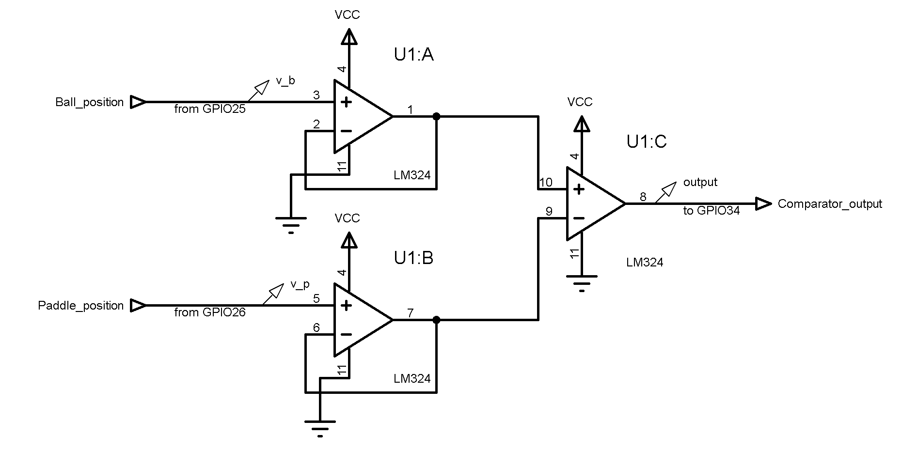

# HIL-Pong: A Hardware-in-the-Loop Analog Feedback Control System

**Author:** Shravan Mathapati
**Platform:** ESP32 + Analog Circuitry + Python (tkinter)
**Domain:** Embedded Systems, Analog Electronics, Control Systems, Hardware-in-the-Loop Simulation

---

## Abstract

This project presents a Hardware-in-the-Loop (HIL) implementation of a real-time analog feedback controller for a virtual Pong environment. Unlike conventional software-only game controllers, the control decision is generated by a physical analog circuit consisting of voltage followers and a comparator. The game environment executes on a host computer, while an ESP32 microcontroller acts as an interface between the virtual plant and the analog controller.

The vertical positions of the ball and paddle are converted into analog voltages using the dual DAC channels of the ESP32. These voltages are processed by an external analog comparator circuit, which determines the relative position of the ball with respect to the paddle. The comparator output is digitized by the ESP32 and transmitted back to the game, forming a complete closed-loop feedback system.

The project demonstrates real-time hardware-software co-design, analog signal processing, DAC utilization, serial communication, and feedback control using low-cost components.

---

## Demonstration

📹 **Project Demonstration Video**

> Insert demo video/GIF here

```md

```

---

## Table of Contents

1. Introduction
2. System Overview
3. Hardware Architecture
4. Software Architecture
5. Communication Protocol
6. Experimental Setup
7. Results
8. Discussion
9. Future Work
10. Repository Structure
11. References

---

# 1. Introduction

Feedback control systems are fundamental to robotics, automation, industrial control, aerospace guidance, and embedded systems.

While modern control systems are predominantly implemented digitally, analog control remains important due to its low latency, simplicity, and ability to process continuous-time signals directly.

The objective of this project is to investigate the feasibility of implementing a real-time analog controller for a virtual environment. A Pong game was selected as the test platform due to its simple dynamics and ease of visualization.

Rather than implementing the paddle controller entirely in software, the controller logic is physically realized using analog circuitry, transforming a simple game into a Hardware-in-the-Loop control experiment.

---

# 2. System Overview

The complete system consists of three major subsystems:

1. Virtual Plant (Python Pong Simulation)
2. Embedded Interface (ESP32)
3. Analog Controller (Comparator Circuit)

## System Block Diagram

> Insert system block diagram here

```md

```

### Control Loop

```text
+---------------------+
|     Pong Game       |
| (Virtual Plant)     |
+----------+----------+
           |
           v
+---------------------+
|       ESP32         |
| DAC Generation      |
+----------+----------+
           |
           v
+---------------------+
| Analog Controller   |
| Voltage Followers   |
| + Comparator        |
+----------+----------+
           |
           v
+---------------------+
| Comparator Output   |
+----------+----------+
           |
           v
+---------------------+
|       ESP32         |
| GPIO Acquisition    |
+----------+----------+
           |
           v
+---------------------+
|   Paddle Command    |
+---------------------+
```

---

# 3. Hardware Architecture

## 3.1 Position Encoding

The ESP32 DAC channels are used to generate analog representations of the virtual game state.

| Signal          | ESP32 Pin |
| --------------- | --------- |
| Ball Position   | GPIO25    |
| Paddle Position | GPIO26    |

The game transmits position information through serial communication, which is converted into analog voltages by the ESP32 DACs.

---

## 3.2 Signal Buffering

Two voltage followers are used to:

* Prevent loading of DAC outputs
* Improve signal integrity
* Isolate DAC stages from the comparator

The voltage followers ensure that the analog signals accurately represent the virtual game state.

---

## 3.3 Comparator Controller

Comparator Inputs:

```text
V+ = Ball Position Voltage
V− = Paddle Position Voltage
```

Decision Logic:

```text
If Vball > Vpaddle
    Output = HIGH

If Vball < Vpaddle
    Output = LOW
```

This effectively implements a bang-bang tracking controller.

---

## Circuit Schematic



---

## Breadboard Implementation


```md


```

---

# 4. Software Architecture

## Python Application

The host computer is responsible for:

* Ball dynamics
* Paddle dynamics
* Collision detection
* Rendering
* Serial communication

The Pong game acts as a virtual plant in the control loop.

---

## ESP32 Firmware

The ESP32 performs:

* Serial data reception
* Position decoding
* DAC voltage generation
* Comparator output acquisition
* Transmission of control decisions

---

# 5. Communication Protocol

A request-response communication protocol is used to maintain synchronization.

## Host → ESP32

Format:

```text
BallPosition,PaddlePosition
```

Example:

```text
120,85
```

---

## ESP32 → Host

Format:

```text
1
```

or

```text
0
```

Where:

| Value | Meaning          |
| ----- | ---------------- |
| 1     | Move Paddle Up   |
| 0     | Move Paddle Down |

---

## Communication Timing

The host transmits:

```text
Ball Position
Paddle Position
```

The ESP32:

1. Updates DAC outputs
2. Reads comparator state
3. Returns control decision

This ensures deterministic closed-loop operation.

---

# 6. Experimental Setup

## Hardware

* ESP32 Development Board
* Operational Amplifier
* Comparator Circuit
* Resistors
* Breadboard
* Jumper Wires
* Laptop

---

## Software

* PlatformIO
* Python
* Pygame
* PySerial

---

# 7. Results

The following observations were made:

* Successful real-time hardware-in-the-loop operation
* Stable serial communication
* Reliable DAC generation
* Correct analog voltage tracking
* Correct comparator operation
* Successful paddle tracking

The controller was able to continuously track the ball trajectory and successfully compete against a human player.

---

## DAC Verification

| DAC Value | Measured Voltage |
| --------- | ---------------- |
| 0         | 0.06 V           |
| 128       | ~1.65 V          |
| 255       | ~3.12 V          |

---


## Control Loop Data

A time-domain plot was generated from serial monitor data.


```md

```


---

# 8. Discussion

The implemented controller is a bang-bang controller.

Control Law:

```text
u = sign(error)

where

error = Ball Position − Paddle Position
```

### Advantages

* Extremely simple
* Low hardware complexity
* Low latency
* Reliable operation

### Limitations

* Binary control output
* Potential switching near equilibrium
* No hysteresis
* No proportional action

Despite these limitations, the controller was capable of effective target tracking within the Pong environment.

---

# 9. Future Work

Possible extensions include:

### Analog Improvements

* Schmitt Trigger Hysteresis
* Differential Amplifier Error Generation
* Analog Proportional Controller
* Analog PID Controller

### Embedded Improvements

* Faster communication protocol
* ADC-based error measurement
* Real-time parameter tuning

### Control-Theoretic Improvements

* Stability Analysis
* Latency Characterization
* Closed-loop Performance Metrics

---

# 10. References

1. ESP32 Technical Reference Manual
2. ESP32 DAC Peripheral Documentation

---

## Keywords

Hardware-in-the-Loop, HIL, Analog Control, Comparator, Operational Amplifier, ESP32, DAC, Embedded Systems, Feedback Control, Real-Time Systems, Signal Conditioning, Control Engineering, Pong Simulation.
